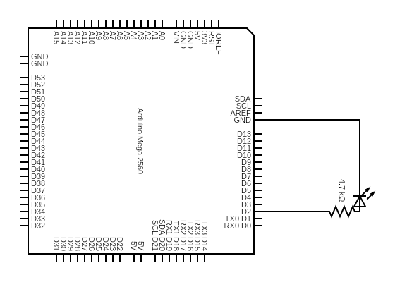

# python-to-arduino-LED
Simple Tkinter GUI Controller to toggle Arduino LED ON/OFF

# 0. Prerequisites

Python 3.11+

-tkinter

-pyfirmata (pip install pyfirmata)

Arduino IDE 

-Firmata library(sketch>include_library>managae_libraries)

-FirmataStandard Sketch(file>example>firmata>FirmataStandard)

Arduino Setup

-arduino board, bread board, LED, 2 wires, resistor

# 1. Instructions
   
-Install prerequisites

-Set up Arduino, connecting desired LED to pin 2

-Connect Arduino to your computer

-Open Arduino IDE > Select your board > Open and upload FirmataStandard example sketch (either from examples or FirmataStandard.ino)

-Run py_to_arduino_demo.py

-Press "ON" to turn light on

-Press "OFF" to turn LED off

# 2. Lincense

MIT Lincense

# 3. Contact

github: soldiers-son
